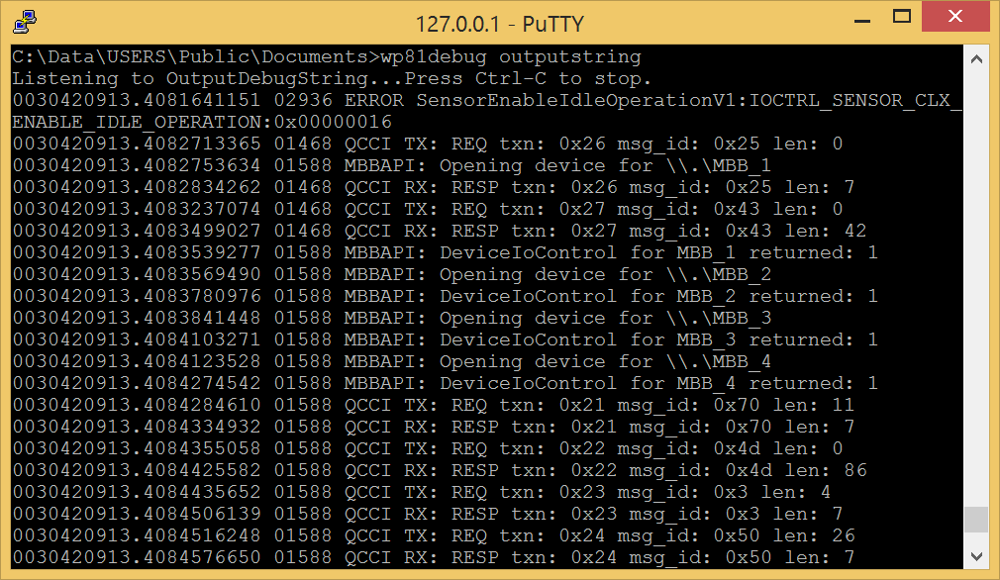
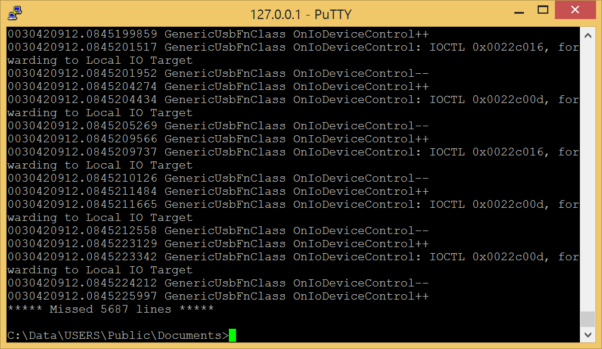
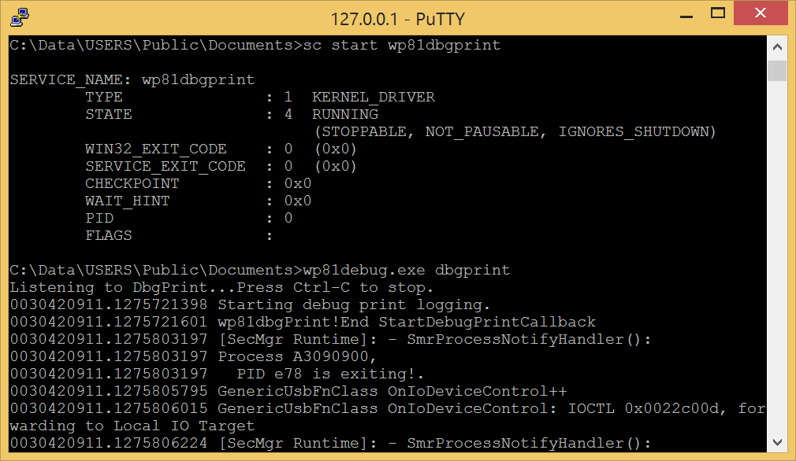

# wp81debug

Attempt to create an equivalent of  the [Sysinternals debugView](https://learn.microsoft.com/en-us/sysinternals/downloads/debugview) for Windows Phone 8.1  
The OutputDebugString part is largely inspired by the article [Mechanism of OutputDebugString](https://www.codeproject.com/Articles/23776/Mechanism-of-OutputDebugString)  
And the DbgPrint part is largely copied from https://github.com/tandasat/DebugLogger

## Usage



Each line has the format H.L \<P\> S  
Where H.L are the [high and low DateTime](https://learn.microsoft.com/en-us/windows/win32/api/minwinbase/ns-minwinbase-filetime) at the moment of the reading of the message.  
P is the ID of the process. Only available in "outputdebug" mode.   
And S is the message.

> [!WARNING]
> In "dbgprint" mode, you have to redirect the output to a file or a filtering tool otherwise the console is not able to sustain the output rate and you will loss messages.  
> The number of messages lost is indicated by `***** Missed X lines *****`  



## Deployment

- [Install a telnet server on the phone](https://github.com/fredericGette/wp81documentation/tree/main/telnetOverUsb#readme), in order to run the application.  
- Manually copy the executable from the root of this GitHub repository to the shared folder of the phone.
> [!NOTE]
> When you connect your phone with a USB cable, this folder is visible in the Explorer of your computer. And in the phone, this folder is mounted in `C:\Data\USERS\Public\Documents`  

### The "dbgprint" mode requires the installation of the kernel driver "wp81dbgPrint.sys"

- Manually copy the .sys from the driver folder of this GitHub repository to the shared folder of the phone.
- Install the driver:
```
sc create wp81dbgPrint type= kernel binPath= C:\Data\USERS\Public\Documents\wp81dbgPrint.sys
```
- Start the driver:
```
sc start wp81dbgPrint
```



## Compilation

- [Visual Studio 2015 with the Windows Phone SDK](https://github.com/fredericGette/wp81documentation/blob/main/ConsoleApplicationBuilding/README.md).  
- [Windows Phone Driver Kit](https://github.com/fredericGette/wp81documentation/blob/main/DriverBuilding/README.md).  
