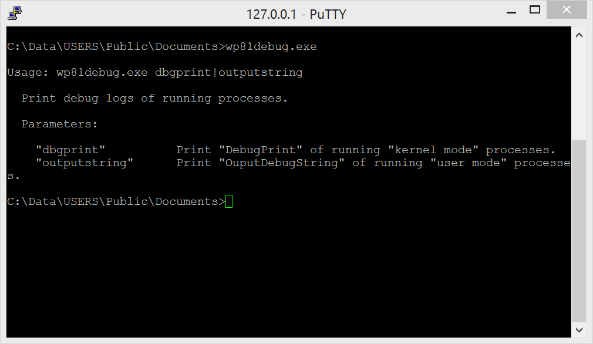

# wp81debug

Attempt to create an equivalent of  the [Sysinternals debugView](https://learn.microsoft.com/en-us/sysinternals/downloads/debugview) for Windows Phone 8.1  

## Usage

Each line has the format X.Y P S  
Where X.Y is the time at the moment of the reading of message.  
P is the ID of the process.  
And S is the message.

> [!WARNING]
> Some messages can be missing when multiple applications are reading the shared memory used by the OutputDebugString function: a message consumed by a reader won't be available to the other readers.  

## Requirements

### Deployment

- [Install a telnet server on the phone](https://github.com/fredericGette/wp81documentation/tree/main/telnetOverUsb#readme), in order to run the application.  
- Manually copy the executable from the root of this GitHub repository to the shared folder of the phone.
> [!NOTE]
> When you connect your phone with a USB cable, this folder is visible in the Explorer of your computer. And in the phone, this folder is mounted in `C:\Data\USERS\Public\Documents`  

### Compilation

- [Visual Studio 2015 with the Windows Phone SDK](https://github.com/fredericGette/wp81documentation/blob/main/ConsoleApplicationBuilding/README.md).  
